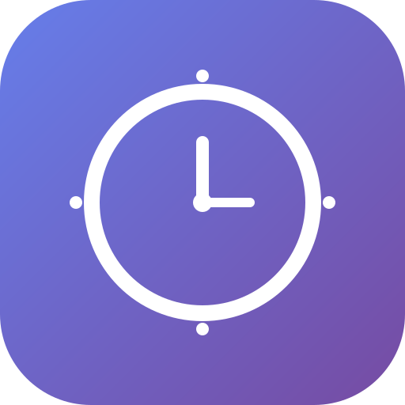

# Simple Focus Timer

<div align="center">
  
  
  <p><strong>A minimalist macOS menu bar focus timer with daily goal tracking</strong></p>
  
  [](https://opensource.org/licenses/MIT)
  [](https://www.apple.com/macos/)
</div>

---

## 🎯 Features

- **Menu Bar Integration**: Lives in your macOS menu bar - always accessible, never intrusive
- **Focus Sessions**: Quick-start timers for 1, 5, 30, or 60 minutes
- **Daily Goal Tracking**: Set and track your daily focus goals (1-10 sessions)
- **Productive Block Settings**: Define what counts as a productive block
- **Clean UI**: Minimalist floating window shows your timer
- **In-Window Cancel**: Cancel running timers directly from the timer window
- **Goal Celebration**: Visual feedback when you complete your daily goal
- **No Dock Icon**: Pure menu bar app - doesn't clutter your dock

## 📸 Screenshots

### Menu Bar Interface
Click the menu bar icon to access quick-start timers and settings.

### Timer Window
A floating window displays your current timer with a cancel button.

### Daily Progress
Track your progress towards daily goals right in the menu bar (e.g., "3/4").

## 🚀 Quick Start

### Download Pre-built App

1. Download the latest `.dmg` file from [Releases](https://github.com/kewal28/simple-focus-timer/releases)
2. Open the `.dmg` file
3. Drag "Simple Focus Timer" to your Applications folder
4. Open the app - you'll see a timer icon in your menu bar
5. Click the icon to start a focus session!

### Run from Source

```bash
# Clone the repository
git clone https://github.com/kewal28/simple-focus-timer.git
cd simple-focus-timer

# Install dependencies
npm install

# Start the app
npm start
```

## 🛠️ Building from Source

### Prerequisites

- Node.js (v16 or later)
- npm (v7 or later)
- macOS (for building .dmg)

### Quick Build

```bash
# Install dependencies
npm install

# Run in development
npm start

# Build production DMG
npm run build
```

**📖 For detailed build instructions, code signing, and distribution guide, see [BUILD.md](BUILD.md)**

The built `.dmg` file will be in the `dist/` directory.

## 📖 Usage

### Starting a Timer

1. Click the menu bar icon
2. Select a duration (1m, 5m, 30m, or 60m)
3. The timer window will appear and start counting down
4. Click "Cancel" in the window to stop early

### Setting Your Daily Goal

1. Click the menu bar icon
2. Navigate to "Daily goal"
3. Select your target (1-10 sessions per day)

### Defining Productive Blocks

1. Click the menu bar icon
2. Navigate to "Productive block (mins)"
3. Select which timer duration counts toward your daily goal
4. Only completed sessions of this duration will count

### Understanding Progress

- Menu bar displays: `current/goal` (e.g., "3/4")
- Complete your daily goal to see a celebration message!
- Progress resets daily at midnight

## 🔧 Configuration

Settings are stored locally using `electron-store`:
- **Location**: `~/Library/Application Support/simple-focus-timer/`
- **File**: `config.json`

### Stored Settings
- Daily goal (default: 4)
- Productive block minutes (default: 60)
- Daily completion counts (historical data)

## 🎨 Customization

### Changing the Icon

Replace `icon.svg` with your own 512x512 SVG icon, then rebuild:

```bash
npm run build
```

### Modifying Timer Durations

Edit `main.js` in the `buildTrayMenu()` function to add/remove timer options.

### UI Styling

Edit `index.html` to customize the timer window appearance (colors, fonts, etc.).

## 📁 Project Structure

```
simple-focus-timer/
├── main.js           # Electron main process (app logic, tray, menu)
├── preload.js        # Secure IPC bridge between main and renderer
├── index.html        # Timer window UI
├── icon.svg          # App icon
├── package.json      # App configuration and build settings
├── README.md         # This file
└── LICENSE           # MIT License
```

## 🐛 Troubleshooting

### App doesn't appear in menu bar
- Check if the app is running (look in Activity Monitor)
- Try quitting and restarting the app
- Restart your Mac if issue persists

### Timer not starting
- Check if another timer is already running
- Try canceling any active timer first

### Can't build DMG
- Ensure you're on macOS
- Install Xcode Command Line Tools: `xcode-select --install`
- Clear node_modules and reinstall: `rm -rf node_modules && npm install`

## 🤝 Contributing

Contributions are welcome! Please feel free to submit a Pull Request.

1. Fork the repository
2. Create your feature branch (`git checkout -b feature/AmazingFeature`)
3. Commit your changes (`git commit -m 'Add some AmazingFeature'`)
4. Push to the branch (`git push origin feature/AmazingFeature`)
5. Open a Pull Request

## 📝 License

This project is licensed under the MIT License - see the [LICENSE](LICENSE) file for details.

## 🙏 Acknowledgments

- Built with [Electron](https://www.electronjs.org/)
- Uses [electron-store](https://github.com/sindresorhus/electron-store) for data persistence
- Built with [electron-builder](https://www.electron.build/) for distribution

## 📮 Support

- **Issues**: [GitHub Issues](https://github.com/kewal28/simple-focus-timer/issues)
- **Discussions**: [GitHub Discussions](https://github.com/kewal28/simple-focus-timer/discussions)

## 🗺️ Roadmap

- [ ] Custom notification sounds
- [ ] Break timer reminders
- [ ] Weekly/monthly statistics
- [ ] Export focus session data
- [ ] Keyboard shortcuts
- [ ] Themes support

---

<div align="center">
  Made with ❤️ for focused productivity
  
  **[Download](https://github.com/kewal28/simple-focus-timer/releases)** • **[Report Bug](https://github.com/kewal28/simple-focus-timer/issues)** • **[Request Feature](https://github.com/kewal28/simple-focus-timer/issues)**
</div>
